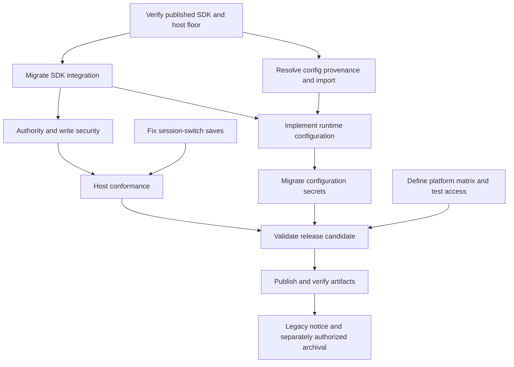

# Modernization critical path and grooming review

Groomed on 2026-09-16 after backlog PR #3 merged as `f49bfdb`. This is the
release dependency path, not a duration-based schedule: effort estimates and
platform access are not established. Both branches below are release gates;
we cannot yet say which will take longer. Ticket status and dependency fields
remain authoritative. All 22 modernization tickets are still unclaimed drafts.

## Release prerequisite graph

The diagram omits redundant transitive edges for readability. The ticket graph
keeps explicit acceptance prerequisites. Optional follow-ups are excluded.

## Recommended execution order

1. Select the independent first work: SDK verification, the save-race fix, and
   platform/access preparation. Only the save fix changes extension behavior.
2. After verification, SDK integration and the configuration import decision
   can proceed in parallel. Prefer landing the small save fix before SDK edits
   to main.go; this reduces conflicts without inventing a semantic dependency.
3. After SDK integration, run authority/conformance and configuration/secrets
   as separate reviewable paths. Conformance also consumes the save regression;
   configuration requires the import decision.
4. Join those results with the platform-access matrix for candidate-bound
   release validation, then deliberate publication and downloaded-artifact tests.
5. Legacy notice/archival is post-publication work. It affects completion of
   the core epic but must not block publishing the validated replacement.

No implementation ticket was promoted during grooming. The user can select
one or more of the first three tickets below; selecting grooming did not
authorize implementation, publication or platform provisioning.

| First candidate | Why it can begin | Output needed by successors |
| --- | --- | --- |
| [TKT-01M2NQ0CW9Y7T06NN29JJ0PW1K (Verify a published Terva SDK and supported host floor)](../../.tickets/draft/TKT-01M2NQ0CW9Y7T06NN29JJ0PW1K.md) | Requirements and local reference contracts exist | Published version, host floor, API/capability matrix and toolchain constraints |
| [TKT-01M2NQ0D3RZAMV83QH6AAX3466 (Keep download saves in the workspace captured at call start)](../../.tickets/draft/TKT-01M2NQ0D3RZAMV83QH6AAX3466.md) | Bug and both handlers are identified; existing path guards provide a baseline | Deterministic blocked-fetch regressions and captured workspace identity |
| [TKT-01M2NQT58ZQPSE95M1WEXPN8SF (Define release test matrix and secure platform test access)](../../.tickets/draft/TKT-01M2NQT58ZQPSE95M1WEXPN8SF.md) | Build targets, CI and current runtime evidence are known | Runtime access/support matrix, fixture slots and candidate-report template |

## Added decision gates

- [TKT-01M2NQT535ETD2WACPHJ93PA48 (Resolve configuration provenance and legacy import semantics)](../../.tickets/draft/TKT-01M2NQT535ETD2WACPHJ93PA48.md) follows SDK verification and gates configuration. The host supplies resolved values, so presence does not distinguish a default from an explicit setting.
- [TKT-01M2NQT58ZQPSE95M1WEXPN8SF (Define release test matrix and secure platform test access)](../../.tickets/draft/TKT-01M2NQT58ZQPSE95M1WEXPN8SF.md) gates release validation. It starts early to reveal unavailable machines or runners instead of discovering them at publication time. It does not require SDK integration or final host versions to plan access.

## Evidence and corrections

The sibling Terva checkout was inspected at
`7f754b9bb7c6754284dc4f3cc5fa6a96525de49d`; its unrelated untracked ticket
was left untouched. These are local contract observations, not verification
of a published SDK. The SDK verification ticket remains open.

| Observation | Grooming change |
| --- | --- |
| Terva docs describe defaults overlaid with user values; ext.Config is a raw JSON map and Has checks presence | Added the provenance/import decision gate and explicit zero/false/empty/default fixtures |
| main.go reads cwd before and after both raw/image network fetches; existing main tests focus on path helpers | Required deterministic blocked-fetch tests that fail on the original implementation and assert no writes in the new workspace |
| conformance_test.go strips ZOT_WEB_* but retains TAVILY_API_KEY | Added complete provider/config environment isolation and local synthetic fixtures |
| An old-config fetch can finish after a new configuration becomes active | Required a stale completion/cache generation test and an explicit policy for already accepted requests |
| Terva docs restrict cached prompt/visibility changes to session boundaries | Required runtime readiness to update immediately while withdrawal/restore waits for the next supported boundary |
| Terva docs say an unknown bootstrap frame may be treated as malformed hello | Required proof of compatibility or deliberate omission/gating before emitting pre-hello progress |
| Five cross-build targets exist, but only Linux amd64 archive execution is recorded; CI uses a Linux docker runner | Added early runtime-access planning with no unsupported assumption of native platform coverage |
| Release automation changes can alter the tested candidate | Bound validation to candidate commit/checksums and required revalidation of the exact tagged commit |

Local evidence files: main.go, main_test.go, conformance_test.go,
internal/config/config.go, .goreleaser.yaml, .forgejo/workflows/ci.yml;
Terva docs/extensions.md and packages/agent/ext/ext.go (Config, Has,
OnSession, and bootstrap sections). All 20 original tickets received entry
inputs, deliverables, validation and coordination notes; new decision tickets
carry the same detail. Implementation plans remain empty until work is claimed.

## Unresolved inputs and who resolves them

| Input | Owner / resolution point |
| --- | --- |
| Published SDK availability, host floor/current test versions, Go requirements | [TKT-01M2NQ0CW9Y7T06NN29JJ0PW1K (Verify a published Terva SDK and supported host floor)](../../.tickets/draft/TKT-01M2NQ0CW9Y7T06NN29JJ0PW1K.md) |
| Host config provenance or a safe import alternative | [TKT-01M2NQT535ETD2WACPHJ93PA48 (Resolve configuration provenance and legacy import semantics)](../../.tickets/draft/TKT-01M2NQT535ETD2WACPHJ93PA48.md) |
| Runtime access for linux arm64, both macOS targets, Windows/Bash and supported host fixtures | [TKT-01M2NQT58ZQPSE95M1WEXPN8SF (Define release test matrix and secure platform test access)](../../.tickets/draft/TKT-01M2NQT58ZQPSE95M1WEXPN8SF.md); user decides any reduction of the five-target release support matrix |
| Candidate-specific installation/upgrade/rollback evidence | [TKT-01M2NQ0DQ10D7KQC2H7W1XVX0A (Validate replacement installation, upgrades and release platforms)](../../.tickets/draft/TKT-01M2NQ0DQ10D7KQC2H7W1XVX0A.md) |
| Actual permission to publish and any required remote setting changes | [TKT-01M2NQ0DVK4ZKJ8QCET28XNTV7 (Publish and smoke-test the first terva-ext-web release)](../../.tickets/draft/TKT-01M2NQ0DVK4ZKJ8QCET28XNTV7.md); obtain approval for the concrete candidate/action |
| Legacy-repository ownership, migration notice and archival authorization | [TKT-01M2NQ0DZR9RMP1PRT1VDA7GQP (Coordinate legacy migration notice and authorized zot-web archival)](../../.tickets/draft/TKT-01M2NQ0DZR9RMP1PRT1VDA7GQP.md); coordinate in that repository before changing it |

The tickets are groomed for their next stage, not certified executable with
all external inputs already available. Do not mark missing access or an
unverified capability as complete. Follow-up discovery/presentation/context,
host-write, cache-isolation and prebuilt-fallback work stays outside the release
path; investigate it after core prerequisites or when explicitly selected.

For every implementation ticket: recheck its referenced code and environment,
claim it only after selection, record a concrete plan, run meaningful checks,
and record actual results in the ticket. Update references when deleting files
or moving ticket paths; this review does not replace that implementation work.
